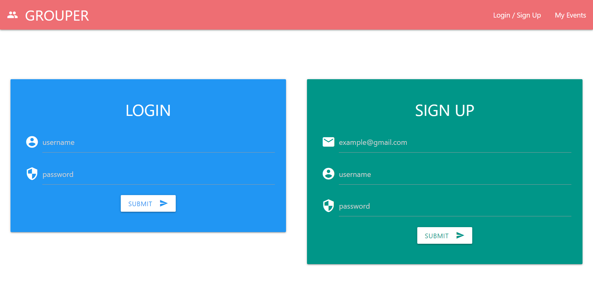
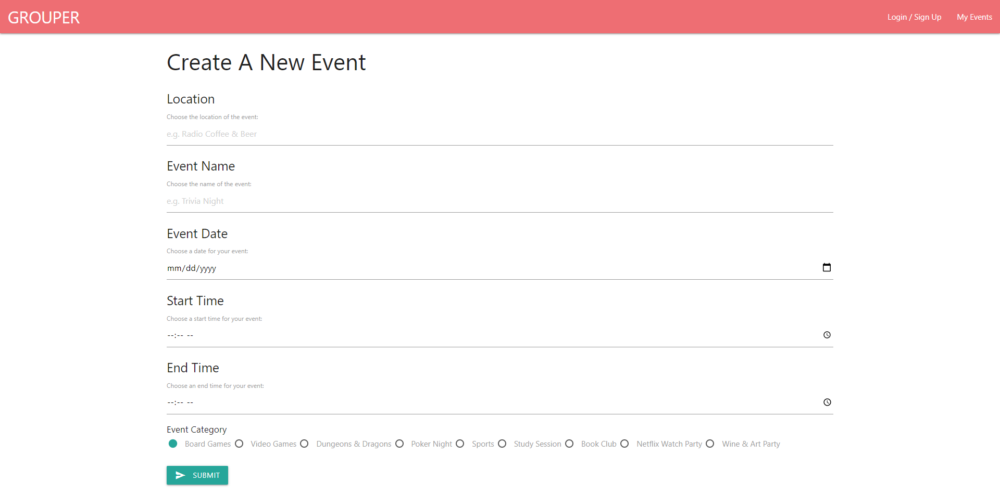

# Grouper-App

## Grouper-App - [https://]()

* Deployable Web Page Link:

* Version 1.0

* Deployment: NOV,3,2021

-  Team Members: Kalvin Nguyen, Damien Luzzo, Fox Rigney, Yafet Amare

# Description

The Grouper App was designed to create events and bring a group of individuals together for events at specific time, date, and locations.
<!-- Grouper is an application based is Austin Texas to helps people create events remotely or socially and helps people connect with friends and family.
our main goal is  -->

# Initials WireFrame Sketch: 
      

# Page Navigation 

### heare is a page where you can sign up and login this way your events will be logged and saved. 

,

### Page to loge your events 

# Future Development

- Make it avelable nationwide 
-
# Requirements:

## Technologies Used: 

 - Materialize 
 - NODE
 - MySQL
 - Heroku
 - Express
 - Handlebars
 - API
 - Moment.js

# Links 
https://github.com/damienluzzo33/Grouper-App