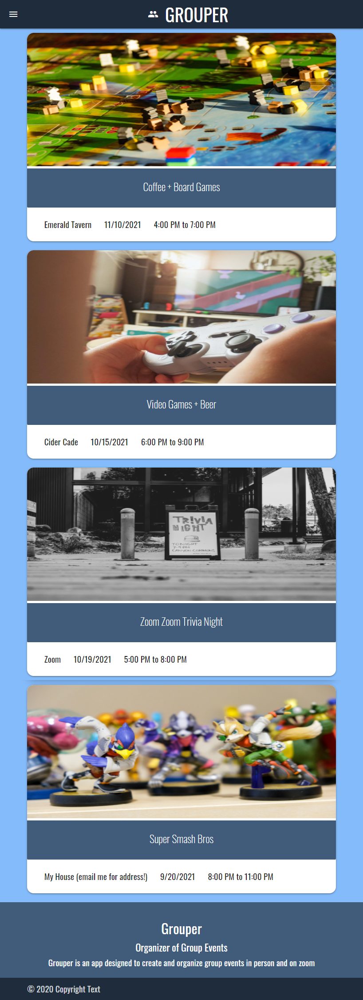
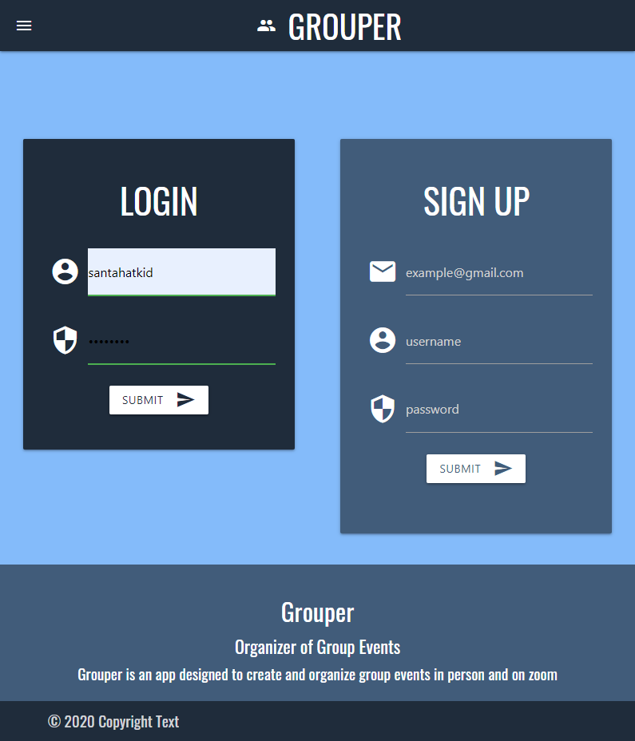
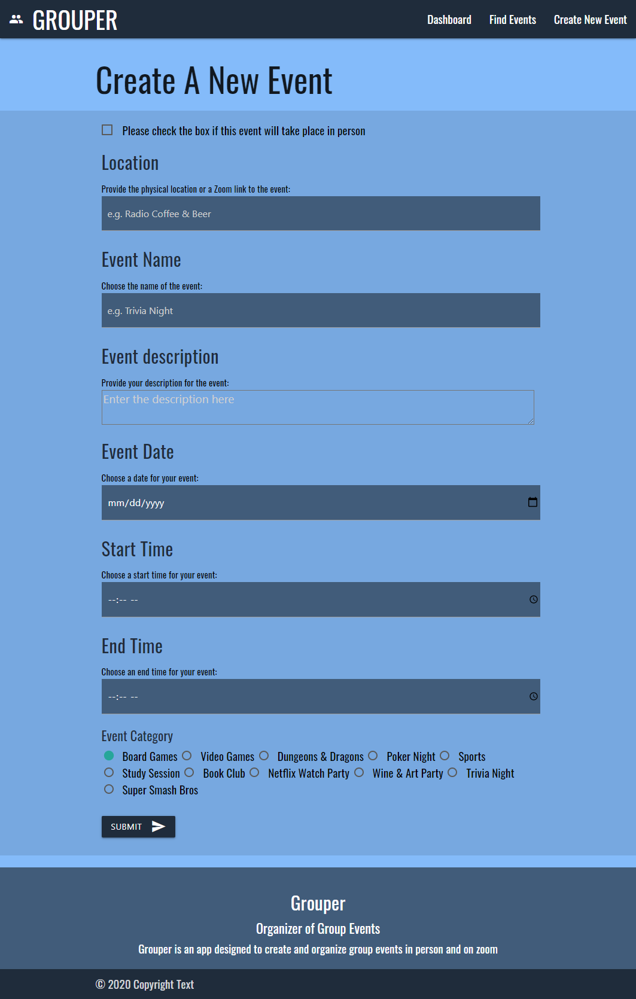
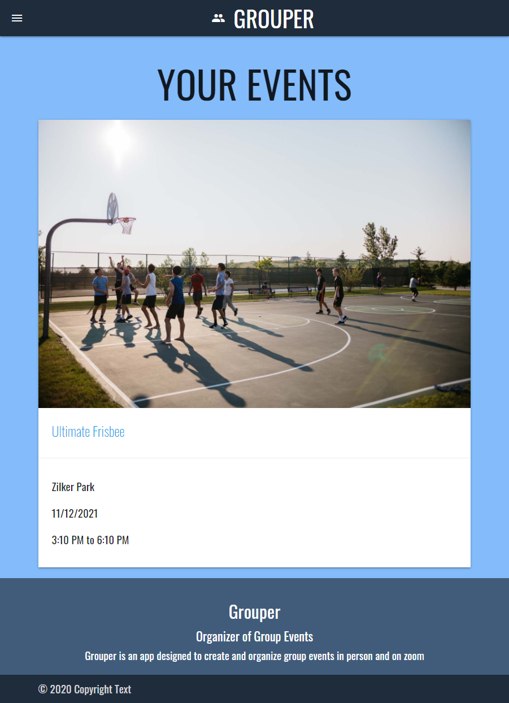
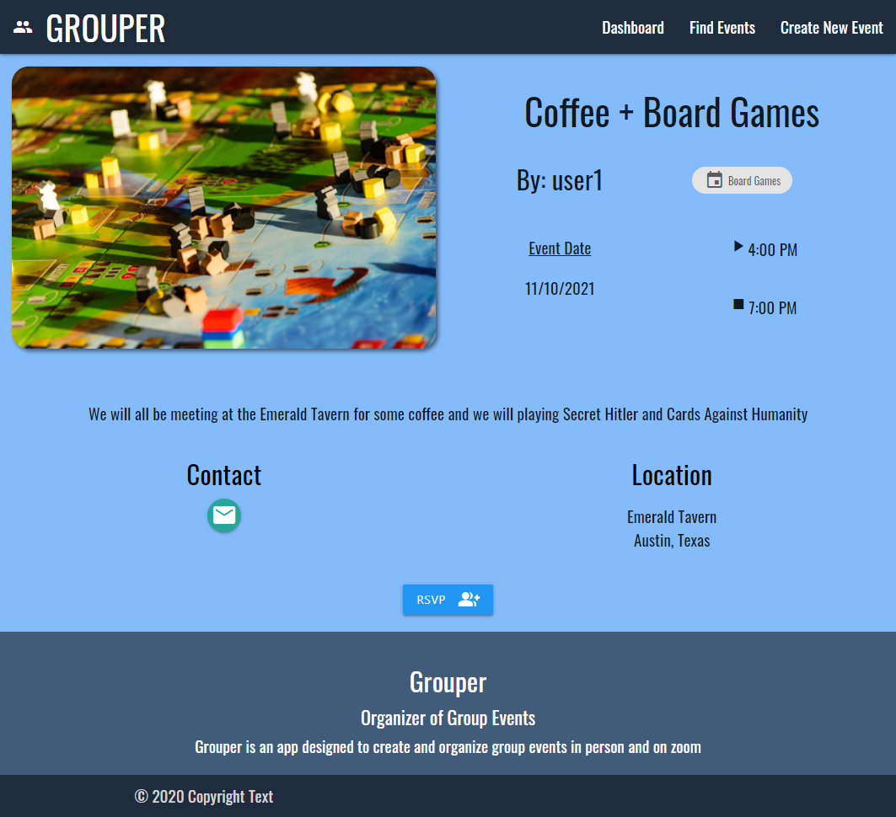
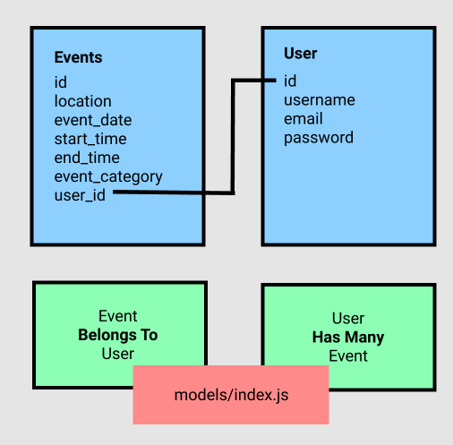
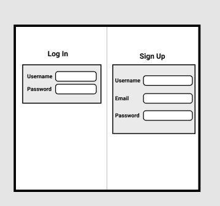
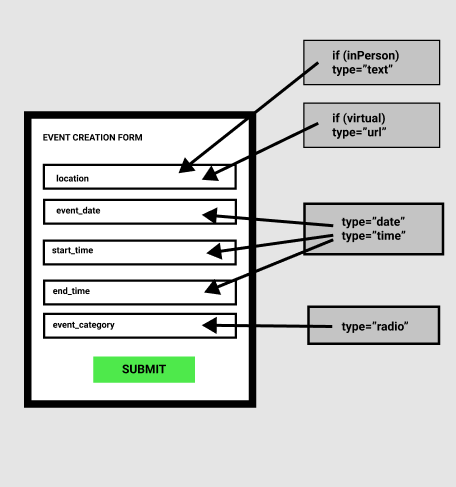

# Grouper-App

* Deployable Web Page Link: 

* Version 1.0

* Deployment: November 5, 2021

*  Team Members: Kalvin Nguyen, Damien Luzzo, Fox Rigney, Yafet Amare

# Table of Contents

- [Installation](#installation)
- [Usage](#usage)
- [Credits](#credits)
- [License](#license)
- [Features](#features)
- [Examples/Tests](#examples)

# Description

Are you new to Austin, TX? Are you looking for a convenient way to connect with people with shared interests? Tired of the complex way in which similar apps like Meet-Up operate? Bored of trying to make new friends by going to Starbucks? Then this is the app for you! 

The Grouper App was designed to allow users of all backgrounds to create events that bring together individuals with similar interests. This is the perfect way to connect strangers and friends both during and after the pandemic. Users can create a new event or they can RSVP for an existing event both in-person and virtually. 

Grouper is an application based in Austin, Texas that aims to helps people create remote or in-person events so that users can easily and efficiently connect with friends and make new ones. Our mission is simple: create a simple way to allow folks to get together while doing something they love, like playing Dungeons and Dragons or Super Smash Brothers.

# Installation

- To install the app, simply clone down this repository to your local machine or just visit the hosted application on Heroku.

# Usage

- Simply visit the hosted application on Heroku and enjoy!
- Check out the giphy to see a short demo, or watch our video recording of the application linked below.

[Link to hosted application on Heroku]()
---

# Screenshots

### This is the Homepage

---
### This is the Login / Sign-Up page for the application

---
### This is where the user is able to create an event

---
### This is the User Dashboard

---
### This is the Event Preview Page

---

# Features
* User can sign up and create an account, and are able to login and logout
* User is able to view all events taking in their area
* User is also able to view their dashboard to see events that they have either created themselves or saved while browsing events created by others
* User has the ability to create a new event using the event creation form
* User can save and unsave events that they are respectively interested in attending and unable to attend
* User can also delete events that they have previously created
* User is automatically logged out after 30 minutes of inactivity

# Credits

## Technologies Used: 
 - Node.js
 - MySQL
 - Sequelize + MySQL2
 - Express.js
 - Moment.js
 - Handlebars
 - Materialize
 - Bcrypt

 ## Contributors
- Fox Rigney [Fox's Github Page](https://github.com/foxrigney)
- Damien Luzzo [Damien's Github Page](https://github.com/damienluzzo33)
- Yafet Amare [Yafet's Github Page](https://github.com/YAFETAMARE)
- Kalvin Nguyen [Kalvin's Github Page](https://github.com/KalvinN361)

## Tutorials

# License

* MIT

# Initial WireFrame Sketches:

* Add custom categories for event creation
* Connect with other app-users nearby
* Show suggestions for nearby events
* Add dynamic weekly calendar to display in user dashboard

# How to Contribute

If you would like to contribute to the Grouper App, please feel free to clone or fork this repository and implement your desired improvements. Once your improvements have been made and the app has been tested properly, please feel free to send any of us a message on github with a short summary of the changes you've made and we will invite you to be a collaborator.

# Examples

Validators are in place to prevent you from inputting incorrect response types. To see an example of how to use this application, please refer to the video or giphy in the description above.

# Questions

* Email Damien: [damienluzzo33@gmail.com](mailto:damienluzzo33@gmail.com)
* Email Fox 🦊: [foxrigney@gmail.com](mailto:foxrigney@gmail.com)
* Email Kalvin: [kalvin.win59@gmail.com](mailto:kalvin.win59@gmail.com)
* Email Yafet: [yafet469@gmail.com](mailto:yafet469@gmail.com)

# Links 
https://github.com/damienluzzo33/Grouper-App